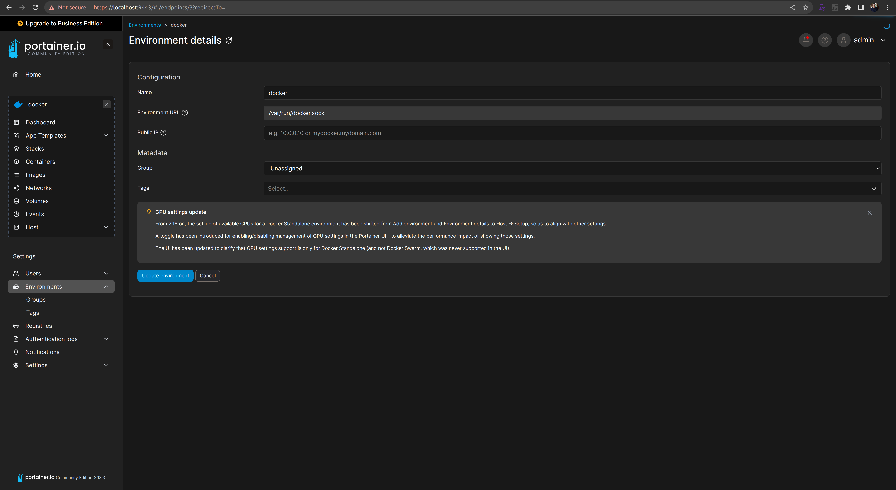
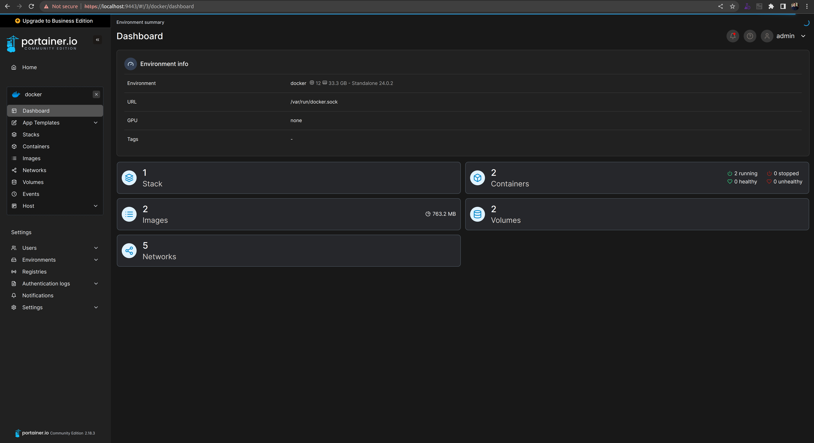
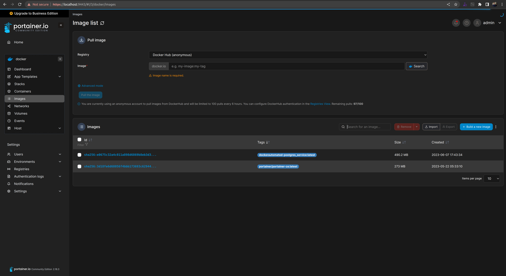

# A PORTAINER AUTOMATED DEPLOYMENT

## TABLE OF CONTENTS

[OVERVIEW](#overview)

[PREREQUISITES](#prerequisites)

[USE CASES](#use-cases)

[ACCESSING AND CONFIGURATION THE GUI](#accessing-and-configuration-the-gui)

## OVERVIEW

The objective of this README.md document file is to provide help on how to run the automated deployment of a [local] containerized Portainer service, as a Proof of Concept (POC), using a Docker Compose yml file.

The Portainer is a powerful, lightweight management UI which allows you to easily build and manage containers your Docker host.

## PREREQUISITES

```
1. "docker": "24.0.2";
2. "docker compose": "2.18.1".
```

## USE CASES

```
docker-compose -f docker-compose-portainer.yml pull
docker-compose -f docker-compose-portainer.yml up -d
```

## ACCESSING AND CONFIGURATING THE GUI

1. Using a browser, access the [local] address: `localhost:9000`;
2. Configure a admin user account;  
3. Using the Wizard tool, configure a [local] environment through a socket connection, as follows:







Note:

If you are using WSL2, then the sock path must be both declared on the shell before running it up, and configured on the Portainer's Environment section as a variable, as follows: `export WSL2_DOCKER_SOCK_PATH=/mnt/wsl/shared-docker/docker.sock`.

See also:

[Official Instalation Guide](https://docs.portainer.io/start/install-ce)

[Official Documentation](https://docs.portainer.io/)

[PostgresSQL DBMS service project](https://github.com/rubenschagas/postgres)
